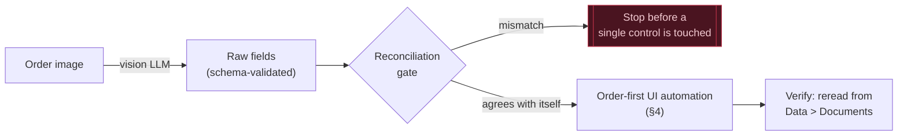
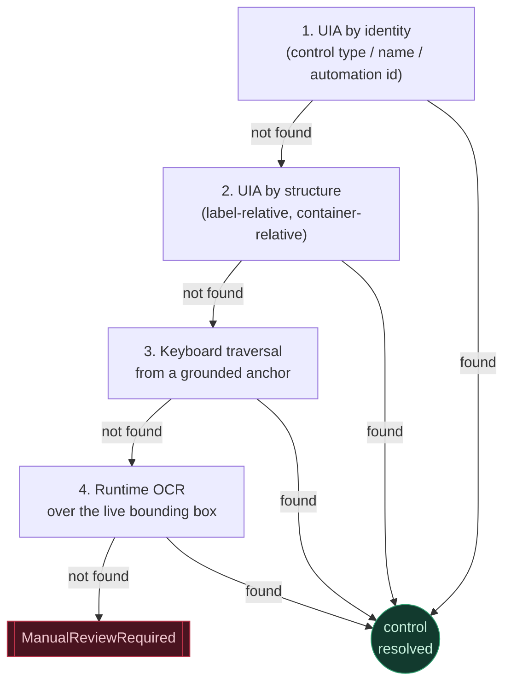
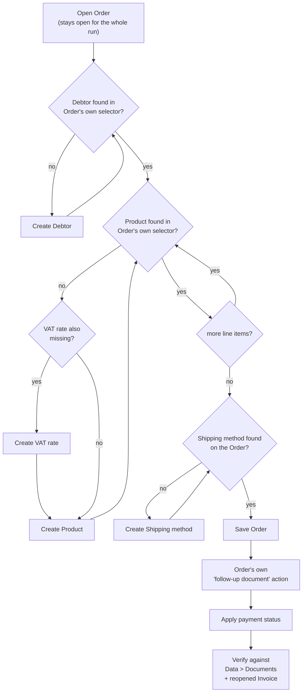
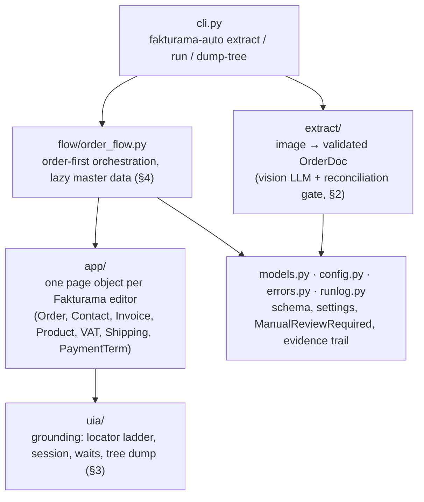

# Grounding the Ledger

**Fakturama Image-to-Cash Automation — Design Note**
*Part 1 of 2 — design, no code. Target app: Fakturama 2 (Eclipse RCP / SWT). Automation: Windows UI Automation. Extraction: vision LLM + arithmetic reconciliation.*


How an order image becomes a saved, verified Order and linked Invoice in Fakturama — without a hardcoded coordinate or a fixed screen layout anywhere on the path.

## 1. The premise

Two independent uncertainties sit on the critical path of this automation, and neither behaves like the other. One is **optical**: the only input is a small, deliberately soft rendering of a sales order, and a misread digit becomes a real invoice line if nothing catches it. The other is **structural**: Fakturama is built on Eclipse RCP and SWT, and SWT's accessibility bridge is honest but incomplete — a button exposes cleanly by name; a custom grid can present itself as a single opaque rectangle with nothing inside it.

The design below treats each uncertainty as its own problem with its own fallback path, and ties them together with one rule that overrides everything else: nothing gets typed into the UI until the numbers agree with themselves, and no control gets clicked until it has been named — never guessed at by position.

### Pipeline at a glance



The two halves never trust each other's arithmetic: the model transcribes, the gate computes, and only an order that agrees with itself is allowed to reach the UI at all.

## 2. Reading the document

A vision model reads the order image directly — Gemini 3.7 Flash — rather than a hand-written OCR-and-regex parser, which would spend more engineering time fighting a 385×530 render than the rest of the automation combined. Before the image is sent it is upscaled with a Lanczos filter to just under the model's own resizing ceiling. That adds no information, but it hands the model roughly an order of magnitude more image tokens to spend describing small type — the one lever available on a source this soft.

The system prompt carries one instruction above the rest: **transcribe, don't calculate.** Every field the model returns has to be something it can point to on the page — never a total worked out from the line items, never a line backfilled from a total. That restriction is what makes the next step meaningful rather than circular.

> **The reconciliation gate.** The order prints its own answer key. Every line's `quantity × unit price × (1 − discount%)` is checked against its printed total; the lines are summed and checked against the printed net, VAT and gross; and the three printed totals are checked against each other. A mismatch anywhere blocks the run before a single control is touched — the cheapest reliability win available in the whole system, and it only works because the model was told not to do this arithmetic itself. If it had derived the totals from the lines, the check would just be validating the model against its own working.

Structured output is enforced through a schema, not requested in free text. Pydantic emits nested models as `$ref`/`$defs`, which is flattened before it is sent, since provider support for that dialect isn't universal and a rejected schema comes back as an opaque 400. If a provider still rejects it, a second path asks for the identical shape in the prompt and validates the answer the same way on the way back in — a weaker path can't produce weaker data, because everything downstream re-runs the same two checks, schema then arithmetic, regardless of which path answered. A validated extraction can also be replayed from disk, so the ninety-first run of the UI flow doesn't re-bill the same unchanging photograph.

## 3. Finding the control

Every control the automation touches is resolved through an ordered ladder. A step only fails once every rung below it has too, and a control is used the moment any rung locates it.

1. **UIA by identity** — control type, name, or automation id. The default, and it covers most of Fakturama's dialogs, buttons and menus cleanly.
2. **UIA by structure** — the table that lives inside the window titled *Select the address*; the field that sits immediately after a label reading *Company* in widget order. SWT rarely names its inputs, but the label beside one is real, visible text, and that relationship survives a resize or a theme change that a coordinate never would.
3. **Keyboard traversal** from a grounded anchor — Tab and arrow-key order stays stable even where the accessibility tree itself is nearly empty.
4. **Runtime OCR** over the control's own live bounding box — used only when the tree is genuinely blind, and computed from the window as it exists right now. Still not a saved coordinate: the box is read fresh every time, wherever the window happens to be.



Each rung is tried only once the rung above it has already failed, and a control is used the instant any rung locates it — the ladder is a fallback chain, not a vote. A total failure across all four is the one path that raises `ManualReviewRequired` from inside the grounding layer itself, rather than from a page object further up.

A locator that fails reports what its container *actually held*, not just what it was looking for — the difference, in practice, between a five-second fix and an afternoon spent guessing at the tree.

Two waiting behaviours are kept deliberately distinct. Waiting for an event — a dialog exists, a tab opened — is one function. Waiting for a value to *settle* is a different one, and it matters here specifically: a filtered address or product search repaints several times while Fakturama filters it, and treating "the list has one row" as the signal to act is exactly the bug that selects a row about to be replaced by the next repaint. The design waits for the list to stop changing, not for it to first contain something.

Writes are verified the same way finds are. Every value typed into a field is read back and compared before the flow moves on — Eclipse text widgets reformat input and occasionally drop a keystroke, and in an accounting system a price that silently landed wrong is a worse outcome than one that visibly crashed the run.

## 4. Staying order-first

```
Open Order → Resolve Debtor → Resolve Products + VAT → Save Order → Follow-up Invoice → Verify
```

The New Order editor opens first and stays open for the length of the run. Selecting the Debtor happens from inside that Order, against its own contact selector — never a separate customer lookup — because the brief's own existence check is "can the Order see it," and nothing else should stand in for that. When the selector shows no exact match, the flow branches to create a Debtor, saves it once, and returns to resolve the same selector again; a successful re-selection is treated as proof the record actually persisted, and a name that doesn't come back is a stop, not a retry.

Each line item repeats the same shape: select the Product from the Order's own selector, create it — and its VAT record, if that's missing too — only on a genuine miss, then come back and select again. The Invoice is generated from the saved Order's own follow-up action, not the toolbar's general Invoice button, because that is the one action that keeps the link between the two documents intact. The run ends by reading the state back from *Data > Documents*, and, for a paid invoice, from the reopened document itself — the only way to know the automation didn't just click convincingly.

Every master-data record on the path — Debtor, Product, VAT rate, Shipping method — follows the identical rule: it is looked up first through the Order's own selector, and created only on a genuine miss, never speculatively upfront:



Nothing in this diagram is created before its absence has actually been observed on the Order itself — a Debtor, Product, VAT rate or Shipping method that already exists never triggers its "create" branch at all.

## 5. What we traded away

**Vision over deterministic OCR** — Chose accuracy on a genuinely soft image over a dependency-free pipeline; paid for with an API key and a per-call cost, offset by replaying a saved extraction instead of re-reading the same photo on every UI iteration.

**A typed stop over a confident guess** — Every ambiguity the brief names — a search with more than one plausible match, a VAT record whose stored value disagrees with the source — raises a review exception instead of picking one. Slower end to end, but a wrong autonomous guess in a saved accounting record costs far more to unwind than a pause does.

**Reading state back over trusting the click** — Every save is confirmed against *Data > Documents*, and the Invoice a second time against its own reopened editor. The extra time per run buys the difference between "probably worked" and "provably worked."

**Attaching over launching** — The default is to attach to an already-running Fakturama, because an RCP cold start plus first-run workspace and database initialisation is slow and easy to leave half-open. A launch path exists for a clean environment, but it isn't the default loop.

## 6. Where this still breaks

- A character that's genuinely below the image's own resolution — the model still answers, but the field is marked low-confidence rather than silently trusted, and a human reviewer is the actual fallback for those.
- A grid that reorders its columns between Fakturama versions — the structural rung assumes today's layout of that specific dialog and would need re-grounding after a version change.
- A decimal convention that flips without warning (comma vs. point) inside a single field — the normaliser guesses from punctuation and could, in principle, guess wrong on a format it hasn't seen.
- An SWT dialog that reparents instead of closing — a small number of Eclipse dialogs do this, and a title-based "has it closed" wait would misread that as still open.

*None of these fail silently. Every one of them either fails the reconciliation gate, raises a named review exception, or times out loudly enough to show up in the run log — which is the actual design goal here: not zero failure, but no undetected one.*

## 7. Repository map

The design above maps directly onto the source layout — each layer only talks to the one below it, so a page object never touches UIA directly and the extraction pipeline never imports anything UI-related at all:



| File | What it's for |
|---|---|
| `cli.py` | The `fakturama-auto` entry point: `extract`, `run`, `dump-tree` subcommands. |
| `models.py` | The two-layer schema — `Raw*` string models the LLM fills in, converted into a `Decimal`-typed `OrderDoc` domain model. |
| `config.py` | `Settings`, resolved once from `.env` / the environment and passed around explicitly. |
| `errors.py` | The exception hierarchy; `ManualReviewRequired` is the one that matters — every named ambiguity in this doc raises it. |
| `runlog.py` | Turns the brief's "annotated screenshots" requirement into a byproduct of the run: a before/failure screenshot and a `run.jsonl` record per step. |
| `extract/base.py` | The extractor protocol every provider implements — the seam everything downstream depends on, not a concrete provider. |
| `extract/gemini_vision.py` | The vision extractor: sends the (upscaled) image and schema to Gemini 3.7 Flash. |
| `extract/prompts.py` | The system/user prompts, deliberately provider-agnostic. |
| `extract/schema.py` | Flattens Pydantic's `$ref`/`$defs` output for providers with a restricted schema dialect. |
| `extract/imaging.py` | Loads, Lanczos-upscales and base64-encodes the source image (§2). |
| `extract/validate.py` | The reconciliation gate — line arithmetic and totals cross-checked against each other. |
| `extract/fixture.py` | Replays a previously-saved extraction from disk instead of calling the API. |
| `uia/locator.py` | The four-rung grounding ladder from §3 (identity → structure → traversal → OCR). |
| `uia/session.py` | Attaching to (default) or launching a Fakturama instance. |
| `uia/waits.py` | The two distinct wait primitives from §3: waiting for an event vs. waiting for a value to settle. |
| `uia/dump.py` | The live UIA tree inspector used to ground every locator against the real widget tree while writing page objects. |
| `app/base.py` | Behaviour shared by every page object — read-back-after-write, retry-the-whole-cycle helpers. |
| `app/order_editor.py` | The Order editor: header, address selector, line items, shipping, the follow-up-Invoice action. |
| `app/contact_editor.py` | The Debtor (contact) editor. |
| `app/invoice_editor.py` | The follow-up Invoice editor, including marking it paid. |
| `app/product_editor.py` | The Product editor. |
| `app/vat_editor.py` | The VAT-rate editor and its list. |
| `app/shipping_editor.py` | The Shipping-method editor and its list. |
| `app/payment_term_editor.py` | The payment-term (method) editor and its list. |
| `flow/order_flow.py` | Orchestrates the page objects into the end-to-end brief: the diagram in §4. |

---

Companion implementation: Python + pywinauto (UIA backend) · extraction via Gemini 3.7 Flash · see the project README for setup and current build status.
